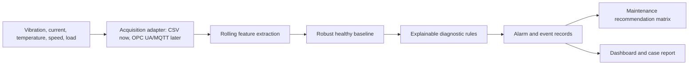

# Architecture

## Purpose

The reliability layer sits above the industrial control layer. It does not own motion control, safety interlocks, or machine sequencing. It observes telemetry, turns samples into condition features, scores those features against a commissioned baseline, and produces maintenance actions that can be reviewed by engineering and operations.

## Logical Flow

## Package Boundaries

- `simulator.py` creates deterministic commissioning and seeded-fault data before hardware is available.
- `features.py` is the signal-processing layer. It computes RMS, kurtosis, crest factor, FFT 1x/2x amplitudes, broadband vibration, current statistics, and temperature slope.
- `baseline.py` fits robust healthy behavior using median/IQR statistics.
- `detector.py` maps evidence to explainable diagnostic scores and alert severities.
- `recommender.py` converts alert episodes into maintenance actions, spares, downtime class, and verification criteria.
- `reporting.py` and `dashboard.py` create the public engineering evidence.

## Integration Boundary

The current data contract is CSV because it is easy to validate and version. In the full automation portfolio, an acquisition adapter should subscribe to:

- OPC UA nodes from PLC, drive, or SCADA.
- MQTT topics from an edge gateway.
- Local DAQ samples for accelerometer and current sensor data.

The downstream pipeline should not change when the acquisition adapter changes, as long as it emits the `data/README.md` schema.

