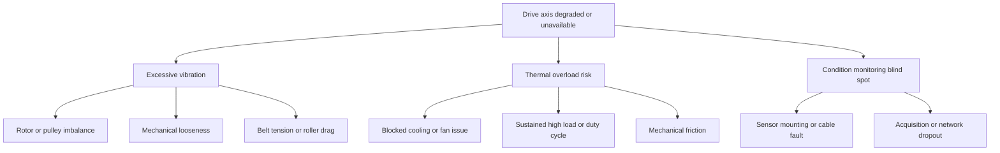

# Fault Tree

Top event: conveyor drive axis unavailable or operating in degraded condition.

## Diagnostic Linkage

- Imbalance is expected to show a dominant 1x shaft-frequency component.
- Looseness is expected to show high crest factor, kurtosis, and broadband vibration.
- Belt tension drift is expected to show current increase at comparable load and speed.
- Overheating is expected to show thermal threshold crossing or positive temperature slope.
- Sensor issues are suspected when vibration evidence is not supported by current, thermal, or acoustic correlation.

